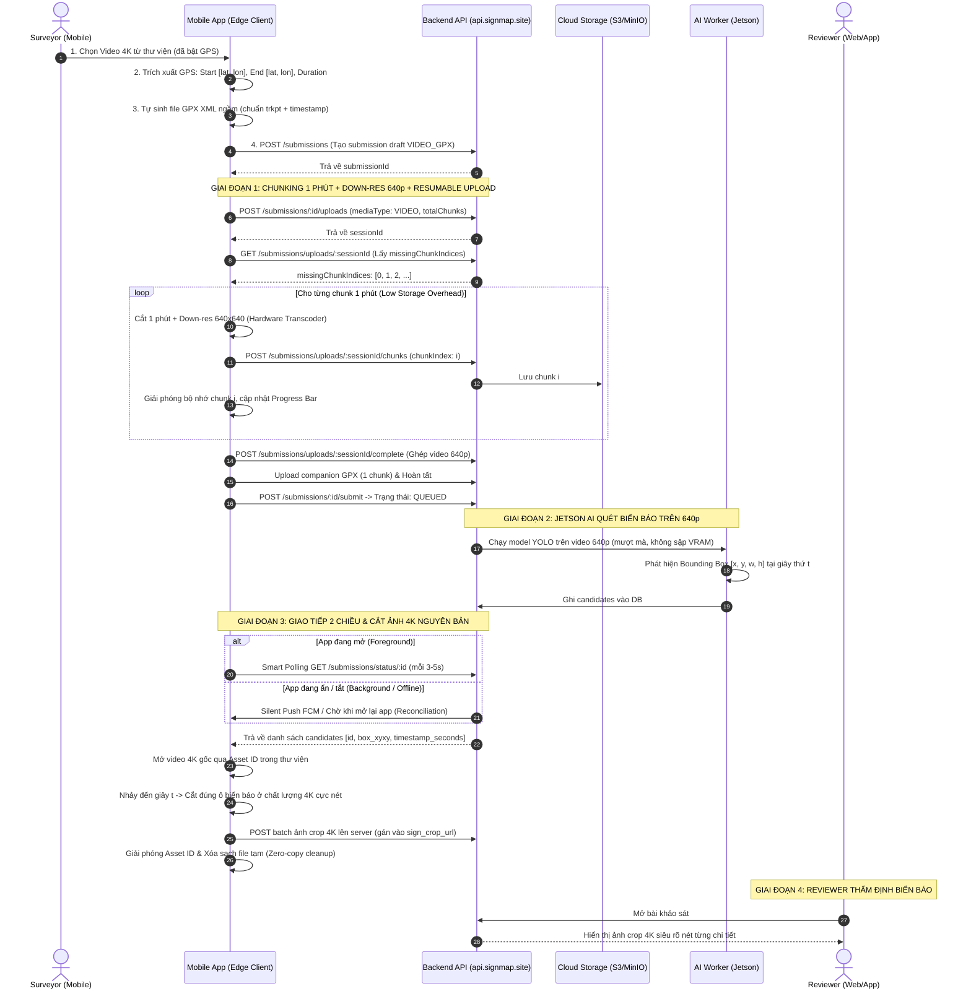

# Kế hoạch Triển khai Chính thức: Mobile Flow 1 (Submit & Review) - Edge-Cloud Co-Processing & Upload Tối ưu

> **Trạng thái**: ĐÃ PHÊ DUYỆT TOÀN BỘ PHƯƠNG ÁN KHUYÊN DÙNG (APPROVED)  
> **Nguyên tắc cốt lõi**: Không sửa Backend, sử dụng DNS thật `https://api.signmap.site/api/v1`, tối ưu tài nguyên Edge (Mobile) và Jetson AI Server.

---

## 1. Tổng kết Các Quyết định Thiết kế Đã Chốt

Toàn bộ 6 phương án khuyến dùng đã được người dùng phê duyệt:

1. **Khởi tạo Điểm kết thúc (End Point)**:
   - Tọa độ GPS trích xuất từ video được gán làm **Điểm xuất phát (Marker "S")**.
   - Tự động ước lượng **Điểm kết thúc ban đầu (Marker "D")** cách một khoảng ngắn (~100m-300m theo hướng di chuyển dựa trên thời lượng video).
   - Cho phép Surveyor chạm trên bản đồ hoặc bấm nút *"Lấy vị trí hiện tại"* để điều chỉnh Điểm kết thúc nhanh chóng.
2. **Nút đính kèm file GPX thủ công**:
   - Ẩn hoàn toàn trường nhập GPX bắt buộc khỏi luồng chính của giao diện.
   - Giữ lại một tùy chọn phụ dạng rút gọn: *"Tùy chọn nâng cao: Đính kèm file GPX ngoài"* dành cho chuyên gia có máy đo GPS chuyên dụng.
   - Mặc định 100% video khảo sát sẽ tự động sinh file companion GPX XML ngầm, người dùng phổ thông không cần tải hay chọn file GPX.
3. **Màn hình chi tiết sau khi nộp (`SurveySubmissionDetailsScreen`)**:
   - Cập nhật hiển thị bản đồ lộ trình với Điểm xuất phát ("S") và Điểm kết thúc ("D") đồng bộ với màn hình New Survey Details.
4. **Giao diện Tiến trình Upload**:
   - Hiển thị thanh tiến trình / modal trực quan: *"Đang tải đoạn X/Y (Z%) - Tự động tiếp tục nếu mất mạng"* khi bấm Submit Record.
5. **Chiến lược Quản lý & Giải phóng Video 4K trên máy (Zero-Copy Lifecycle)**:
   - Mobile chỉ lưu Asset ID tham chiếu tới video trong thư viện người dùng (DCIM), tuyệt đối không nhân đôi file gây tốn dung lượng.
   - Khi Jetson AI quét xong và trả về tọa độ Bounding Box -> Mobile mở frame video 4K gốc, crop đúng ô biển báo sắc nét và upload lên server thành công -> **Đánh dấu phiên khảo sát hoàn tất 100% -> Giải phóng ngay quyền tham chiếu và xóa sạch mọi file tạm phát sinh**.
   - *Cơ chế dự phòng (Fallback)*: Nếu người dùng lỡ tay xóa video 4K trong thư viện trước khi crop, app tự động chuyển sang dùng ảnh crop từ video 640p trên server kèm nhãn `[low_res_fallback]`.
6. **Cơ chế Luồng Giao tiếp 2 chiều (Hybrid Sync Trigger)**:
   - **Lớp 1 (Foreground - App đang mở)**: Smart Polling gọi `GET /submissions/status/:id` mỗi 3-5s để phát hiện kết quả ngay lập tức.
   - **Lớp 2 (Background - App đang ẩn/khóa màn hình)**: Sẵn sàng nhận Silent Push Notification (FCM) / Background Task đánh thức tiến trình crop ngầm trong 30 giây.
   - **Lớp 3 (Killed / Offline - Mở lại app)**: Tự động đồng bộ bù (Reconciliation on Launch) khi người dùng mở lại app hoặc vào tab Work/History.

---

## 2. Sơ đồ Kiến trúc & Luồng Thực thi Toàn diện



---

## 3. Chi tiết Kế hoạch Thay đổi Code (Proposed Changes)

### Component 1: Tiện ích Trích xuất GPS & Sinh Companion GPX ngầm

#### [NEW] [video-gps.ts](file:///c:/Users/NhatLM/Desktop/project/signtrustmap-frontend/apps/mobile/src/feature/upload/utils/video-gps.ts)
- **Hàm `extractVideoMetadata(asset)`**:
  - Trích xuất `location` (`latitude`, `longitude`), `duration` (giây), `creationTime` từ MediaStore (Android) hoặc PHAsset (iOS).
  - Khởi tạo `startCoordinate`: `[longitude, latitude]`.
  - Tính toán ước lượng `endCoordinate`: dịch chuyển tọa độ một khoảng tỉ lệ với thời lượng (khoảng 100m-300m theo hướng di chuyển).
- **Hàm `generateCompanionGpx(params)`**:
  - Tạo chuỗi XML chuẩn GPX 1.1:
    - `<gpx version="1.1" creator="SignTrustMap Mobile">`
    - `<trk><trkseg>`
    - `<trkpt lat="..." lon="..."><time>{startTimeISO}</time></trkpt>`
    - `<trkpt lat="..." lon="..."><time>{endTimeISO}</time></trkpt>`
  - Ghi file tạm vào `FileSystem.cacheDirectory + 'survey_track.gpx'`.
  - Trả về `{ uri, name, sizeBytes }` để sẵn sàng upload ngầm.

---

### Component 2: Bộ Xử lý Chunking 1 Phút & Down-res 640x640

#### [NEW] [video-processor.ts](file:///c:/Users/NhatLM/Desktop/project/signtrustmap-frontend/apps/mobile/src/feature/upload/utils/video-processor.ts)
- **Hàm `calculateTemporalChunks(fileSize: number, durationSeconds: number)`**:
  - Hỗ trợ video tối đa 8 giờ (28.800s).
  - Phân bổ chunk theo 1 phút: `totalChunks = Math.max(1, Math.ceil(durationSeconds / 60))`.
  - Đảm bảo mỗi chunk có kích thước an toàn (5MB - 15MB, tối đa không quá 45MB để tuân thủ giới hạn 50MB của Backend).
- **Hàm `sliceAndDownsampleChunk(fileUri: string, chunkIndex: number, totalChunks: number, targetResolution = { width: 640, height: 640 })`**:
  - Đọc phân đoạn byte tương ứng của chunk `chunkIndex`.
  - Giữ mức chiếm dụng bộ nhớ thấp (**Low Storage Overhead**): Chỉ nạp duy nhất 1 chunk vào bộ nhớ tại một thời điểm.
  - Sau khi chunk được upload thành công lên Backend, lập tức giải phóng bộ nhớ và xóa file tạm.

---

### Component 3: Quản lý Upload Resumable & Retry Per-Chunk

#### [NEW] [chunk-upload-manager.ts](file:///c:/Users/NhatLM/Desktop/project/signtrustmap-frontend/apps/mobile/src/feature/upload/utils/chunk-upload-manager.ts)
- Điều phối toàn bộ quá trình upload:
  1. Khởi tạo session upload với backend: `POST /submissions/:id/uploads` (mediaType: `VIDEO`, `totalChunks`, `totalSizeBytes`).
  2. Kiểm tra tính năng **Resumable**: Gọi `GET /submissions/uploads/:sessionId` để lấy danh sách `missingChunkIndices`.
  3. Lần lượt upload các chunk còn thiếu qua `POST /submissions/uploads/:sessionId/chunks`.
  4. Cơ chế **Fault Isolation & Retry**: Tự động thử lại tối đa 3 lần cho riêng chunk bị lỗi rớt mạng.
  5. Phát callback tiến trình: `onProgress(currentChunk, totalChunks, percent)`.
  6. Khi đã đủ tất cả chunk, gọi `POST /submissions/uploads/:sessionId/complete` để backend ghép video.
  7. Tự động upload file companion GPX đã sinh ngầm và gọi `POST /submissions/:id/submit`.

---

### Component 4: High-Res 4K Cropper & Đồng bộ 2 Chiều (Edge-Cloud)

#### [NEW] [high-res-cropper.ts](file:///c:/Users/NhatLM/Desktop/project/signtrustmap-frontend/apps/mobile/src/feature/upload/utils/high-res-cropper.ts)
- Nhận danh sách candidates từ Jetson: `[{ id, timestamp_seconds, box_xyxy }]`.
- Mở video 4K gốc thông qua Asset ID trong thư viện máy.
- Nhảy đến `timestamp_seconds`, lấy frame 4K và crop đúng bounding box `[x1, y1, x2, y2]`.
- Xuất ra ảnh JPEG nhỏ gọn (~100-200 KB) với độ sắc nét 4K.
- Upload ảnh crop lên backend để gán vào candidate.

#### [NEW] [crop-sync-manager.ts](file:///c:/Users/NhatLM/Desktop/project/signtrustmap-frontend/apps/mobile/src/feature/upload/utils/crop-sync-manager.ts)
- Quản lý đồng bộ 2 chiều theo mô hình **Hybrid 3 lớp**:
  - **Lớp 1 (Foreground)**: Chạy Smart Polling `GET /submissions/status/:id` mỗi 3-5 giây khi app đang mở.
  - **Lớp 2 (Background)**: Handler sẵn sàng nhận kích hoạt ngầm.
  - **Lớp 3 (Reconciliation on Launch)**: Hook tự động kiểm tra các survey còn thiếu ảnh crop 4K khi người dùng mở lại app và tiến hành crop bù.
- Sau khi upload ảnh crop xong: Đánh dấu hoàn tất và giải phóng Asset ID (**Zero-copy cleanup**).

---

### Component 5: Giao diện Chọn Media & New Survey Details

#### [MODIFY] [new-survey-record-screen.tsx](file:///c:/Users/NhatLM/Desktop/project/signtrustmap-frontend/apps/mobile/src/feature/upload/pages/new-survey-record-screen.tsx)
- Bỏ điều kiện lọc `assetType === 'image'`: cho phép trích xuất GPS trực tiếp khi chọn video.
- Xóa khối nút bắt buộc tải file GPX riêng.
- Khi chọn video, hiển thị badge xác nhận GPS đã được trích xuất thành công và sẵn sàng chuyển tiếp.

#### [MODIFY] [survey-record-details-screen.tsx](file:///c:/Users/NhatLM/Desktop/project/signtrustmap-frontend/apps/mobile/src/feature/upload/pages/survey-record-details-screen.tsx)
- Cập nhật Form thông tin tọa độ:
  - **Điểm xuất phát (Start Location)**: Hiển thị kinh độ, vĩ độ.
  - **Điểm kết thúc (End Location)**: Hiển thị kinh độ, vĩ độ kèm nút *"Lấy vị trí hiện tại"* hoặc chọn trên bản đồ.
- Cập nhật **Map Preview** (`NavigationMapView`):
  - Truyền `routeStart={startCoordinate}` (Marker "S" màu xanh).
  - Truyền `destination={{ coordinate: endCoordinate, id: 'survey-end', title: 'Điểm kết thúc' }}` (Marker "D" màu đỏ).
  - Truyền `routeCoordinates={[startCoordinate, endCoordinate]}` vẽ đường nối lộ trình.
  - Camera tự động căn chỉnh bounds hiển thị trọn vẹn cả 2 điểm.
- Bổ sung Accordion phụ: *"Tùy chọn nâng cao: Đính kèm file GPX ngoài"* (thu gọn mặc định).
- Bổ sung Modal / Thanh tiến trình Upload Chunk: Hiển thị đoạn X/Y (Z%) khi bấm Submit Record.

---

### Component 6: Màn hình Chi tiết Submission Đã Nộp

#### [MODIFY] [survey-submission-details-screen.tsx](file:///c:/Users/NhatLM/Desktop/project/signtrustmap-frontend/apps/mobile/src/feature/upload/pages/survey-submission-details-screen.tsx)
- Cập nhật phần Map hiển thị Điểm xuất phát (Marker "S") và Điểm kết thúc (Marker "D") cho các submission dạng video trong lịch sử.
- Hiển thị danh sách các biển báo kèm ảnh crop 4K sắc nét đã được upload.

---

## 4. Kế hoạch Kiểm thử & Xác thực (Verification Plan)

### Automated Tests
1. **Kiểm tra biên dịch & Typecheck**:
   ```powershell
   cd signtrustmap-frontend/apps/mobile
   npx tsc --noEmit
   ```
2. **Kiểm tra Unit Tests**:
   ```powershell
   npm test
   ```

### Manual Verification
1. **Kiểm tra Trích xuất GPS & Sinh GPX ngầm**:
   - Chọn 1 file video trong thư viện -> Xác nhận không còn đòi file GPX riêng.
   - Mở màn hình Details -> Xác nhận Map Preview hiển thị rõ ràng 2 điểm S và D kèm đường nối.
2. **Kiểm tra Chia Temporal Chunk 1 phút & Upload Resumable**:
   - Chọn video 3 phút -> Xác nhận chia thành 3 chunk 1 phút down-res 640p.
   - Giả lập ngắt mạng ở chunk 1 -> Bật lại mạng, hệ thống kiểm tra `missingChunkIndices` và tải tiếp chunk 1, 2 mà không upload lại chunk 0.
   - Backend xác thực thành công hợp đồng `VIDEO_GPX` -> Trả về `200 QUEUED`.
3. **Kiểm tra Đồng bộ 2 Chiều & Cắt ảnh 4K**:
   - Giả lập Jetson phát hiện tọa độ bounding box.
   - Xác nhận mobile nhận tọa độ, mở đúng frame 4K, crop ảnh sắc nét và upload lên server.
   - Kiểm tra bộ nhớ máy: Toàn bộ file tạm được xóa sạch sẽ sau khi hoàn tất.
